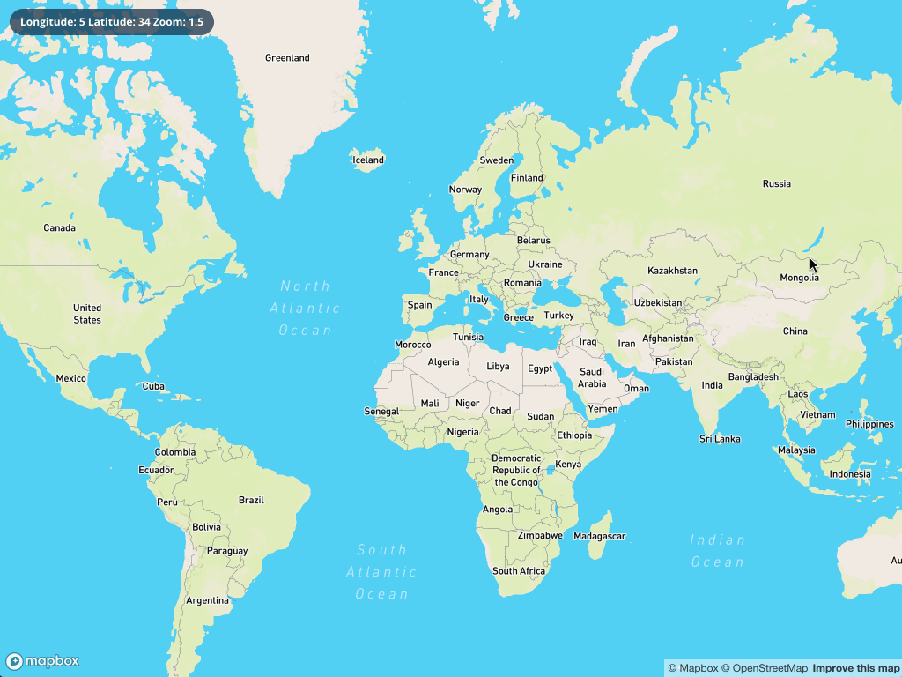

# Map Analytics Dashboard

## Overview
The **Map Analytics Dashboard** is an advanced, interactive geospatial visualization platform built with **React.js** and **Mapbox GL JS**. Designed for real-time geographic data analysis, this application seamlessly integrates **GeoJSON** to enable dynamic filtering, rendering, and manipulation of geospatial datasets. The dashboard prioritizes **performance optimization** and **mobile-first design**, ensuring high usability across different devices.

## Example Dashboard
Here is a preview of the **Map Analytics Dashboard** displaying dynamic geospatial data:


## Key Features
- **Real-Time Interactive Map Rendering**: Uses **Mapbox GL JS** for high-performance map rendering with smooth transitions and animations.
- **GeoJSON Data Integration**: Supports dynamic loading, filtering, and rendering of **geospatial datasets**, making it suitable for real-time analytics.
- **Optimized Rendering & Performance**: Implements efficient rendering techniques to enhance performance and responsiveness.
- **Customizable Map Layers & Styles**: Allows configuration of multiple layers, markers, and styles to represent different data categories.
- **Mobile-First & Cross-Platform Compatibility**: Fully responsive design ensures accessibility across desktops, tablets, and smartphones.
- **User Interaction & Filtering**: Provides advanced filtering mechanisms to explore geospatial trends and insights.

## Tech Stack
- **Frontend Framework**: React.js, JavaScript (ES6+), CSS
- **Mapping Library**: Mapbox GL JS
- **Data Format**: GeoJSON
- **State Management**: React Context API (or Redux, if applicable)

## Installation & Setup
### Prerequisites
Ensure you have the following installed:
- **Node.js** (Latest LTS version recommended)
- **npm** (or **yarn**) for package management

### Clone the Repository
```sh
git clone https://github.com/your-repo/map-analytics-dashboard.git
cd map-analytics-dashboard
```

### Install Dependencies
```sh
npm install
```

### Set Up Mapbox Access Token
1. Register at [Mapbox](https://www.mapbox.com/) and create an API access token.
2. Create a `.env` file in the project root directory and add:
   ```env
   REACT_APP_MAPBOX_ACCESS_TOKEN=your_mapbox_access_token_here
   ```

### Running the Application
To start the development server:
```sh
npm start
```
- Open `http://localhost:3000` in your web browser to access the dashboard.

## Project Structure
```
map-analytics-dashboard/
├── src/
│   ├── components/    # Reusable React components
│   ├── assets/        # Static images and icons
│   ├── styles/        # Global and component-specific styles
│   ├── App.js         # Main application file
│   ├── index.js       # Entry point of the app
│   ├── states.js      # GeoJSON data for state boundaries
│   ├── ...
├── public/
├── .env               # Environment variables
├── package.json       # Project dependencies & scripts
├── README.md          # Documentation
```

## Deployment
### Build for Production
```sh
npm run build
```
- This generates an optimized production-ready build inside the `build/` directory.

### Deploying to GitHub Pages (Optional)
To deploy your project on **GitHub Pages**, follow these steps:
1. Install `gh-pages`:
   ```sh
   npm install gh-pages --save-dev
   ```
2. Add the following configuration to `package.json`:
   ```json
   "homepage": "https://your-username.github.io/map-analytics-dashboard",
   "scripts": {
     "predeploy": "npm run build",
     "deploy": "gh-pages -d build"
   }
   ```
3. Deploy with:
   ```sh
   npm run deploy
   ```

This project was bootstrapped with [Create React App](https://github.com/facebook/create-react-app).


## Available Scripts

In the project directory, you can run:

### `npm start`

Runs the app in the development mode.\
Open [http://localhost:3000](http://localhost:3000) to view it in your browser.

The page will reload when you make changes.\
You may also see any lint errors in the console.

### `npm test`

Launches the test runner in the interactive watch mode.\
See the section about [running tests](https://facebook.github.io/create-react-app/docs/running-tests) for more information.

### `npm run build`

Builds the app for production to the `build` folder.\
It correctly bundles React in production mode and optimizes the build for the best performance.

The build is minified and the filenames include the hashes.\
Your app is ready to be deployed!

See the section about [deployment](https://facebook.github.io/create-react-app/docs/deployment) for more information.

### `npm run eject`

**Note: this is a one-way operation. Once you `eject`, you can't go back!**

If you aren't satisfied with the build tool and configuration choices, you can `eject` at any time. This command will remove the single build dependency from your project.

Instead, it will copy all the configuration files and the transitive dependencies (webpack, Babel, ESLint, etc) right into your project so you have full control over them. All of the commands except `eject` will still work, but they will point to the copied scripts so you can tweak them. At this point you're on your own.

You don't have to ever use `eject`. The curated feature set is suitable for small and middle deployments, and you shouldn't feel obligated to use this feature. However we understand that this tool wouldn't be useful if you couldn't customize it when you are ready for it.

## Learn More

You can learn more in the [Create React App documentation](https://facebook.github.io/create-react-app/docs/getting-started).

To learn React, check out the [React documentation](https://reactjs.org/).

### Code Splitting

This section has moved here: [https://facebook.github.io/create-react-app/docs/code-splitting](https://facebook.github.io/create-react-app/docs/code-splitting)

### Analyzing the Bundle Size

This section has moved here: [https://facebook.github.io/create-react-app/docs/analyzing-the-bundle-size](https://facebook.github.io/create-react-app/docs/analyzing-the-bundle-size)

### Making a Progressive Web App

This section has moved here: [https://facebook.github.io/create-react-app/docs/making-a-progressive-web-app](https://facebook.github.io/create-react-app/docs/making-a-progressive-web-app)

### Advanced Configuration

This section has moved here: [https://facebook.github.io/create-react-app/docs/advanced-configuration](https://facebook.github.io/create-react-app/docs/advanced-configuration)

### Deployment

This section has moved here: [https://facebook.github.io/create-react-app/docs/deployment](https://facebook.github.io/create-react-app/docs/deployment)

### `npm run build` fails to minify

This section has moved here: [https://facebook.github.io/create-react-app/docs/troubleshooting#npm-run-build-fails-to-minify](https://facebook.github.io/create-react-app/docs/troubleshooting#npm-run-build-fails-to-minify)


## License
This project is licensed under the **MIT License**.

